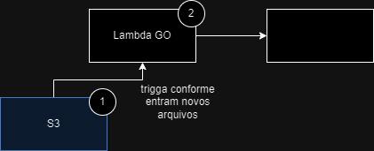

# golang-aws-dojo-ConspiraGo
## Resumo

O plano para cumprir o desafio foi criar uma lambda acionada quando cai um novo arquivo num bucket S3. A Lambda usa o serviço da AWS Textract (https://docs.aws.amazon.com/textract/latest/dg/what-is.html) para reconhecer o tipo de documento, identificar o block signature com as coordenadas do mesmo, depois usamos o GO (lib image, função slice) para recortar essa imagem com a assinatura e retiramos o fundo dela. 

O resultado é a imagem da assinatura e um arquivo json com todos os dados extraídos pelo textract.

## Features

- S3 trigger da lambda
- Textract (Pega sing.) coordenadas
- Recorte
- Retirada do fundo do recorte
- Retorno o resultado Textract Json 
- Makefile (Bucket, lambda)

